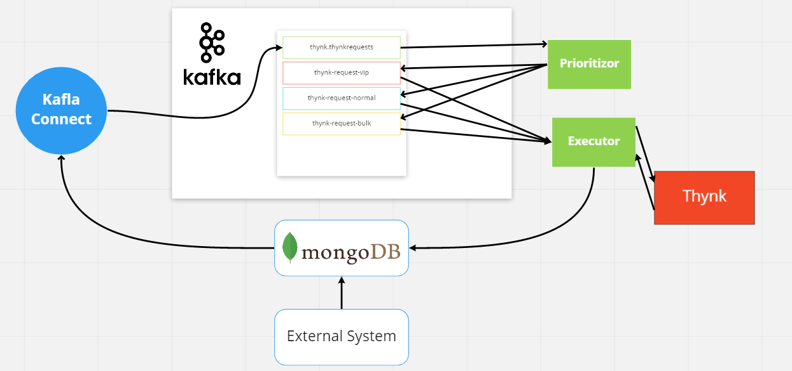

# Thynk Messaging


---

Thynk messaging provides a facade to the Thynk Rule Engine System using a 
microservice architecture. The services communicate via 
asynchronous messaging using [Apache Kafka](https://kafka.apache.org/documentation/).

--- 

## Quick start

Steps to run the system in a development environment:
1. Make sure to [install Docker](https://docs.docker.com/get-docker/).
2. Start the Docker Engine.
3. Make sure to [install Docker Compose](https://docs.docker.com/compose/install/)
4. Simply use the run script to spin up the system using the following command:
    ```bash
    ./run
    ```
5. Use the stop script to take the system down using the following command:
    ```bash
    ./stop
    ```
## System architecture



The diagram above illustrates a basic deployment of the system
 (usually in a development environment).

## Kafka
The system, in this case, has a single Kafka broker with four topics
* thynk.thynkrequests
* thynk-request-vip 
* thynk-request-normal
* thynk-request-bulk

## Kafka connect
Thynk request are submitted by external systems by insertion into MongoDB. 
A Kafka Connector watches the database and writes any incoming requests to the 
"thynk.thynkrequets" topic.  
 
## Prioritizor
The Prioritizor service (the thynk-requests-prioritizor module of this project), as
its name suggests, is responsible for distributing requests to the remaining topics 
based on their priority.

## Executor
The Executor service (the thynk-requests-executor module of this project), listens 
to messages from the three topics and relays them to the Thynk Soap Web Service. 
After the web service returns a result, the Executor saves that result back in MongoDb
for external systems to consume.